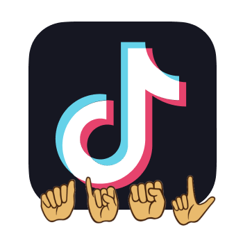

<h2 align="center"><b>AiSL</b></h2>

<p align="center">

</p>

<h4 align="center">
  <b>Sign Language Accessibility for TikTok Creators and Audience</b>
  <br /><br />
  <a href="https://devpost.com/software/aisl-ai-powered-sign-language-accessibility">2024 TikTok TechJam</a>
</h4>

<p align="center">
<a href="https://github.com/Vinny0712/AiSL/blob/master/LICENSE" target="blank">

</a>
<a href="https://github.com/Vinny0712/AiSL/fork" target="blank">

</a>
<a href="https://github.com/Vinny0712/AiSL/stargazers" target="blank">

</a>
<a href="https://github.com/Vinny0712/AiSL/issues" target="blank">

</a>
<a href="https://github.com/Vinny0712/AiSL/pulls" target="blank">

</a>
</p>

<p align="center">
    <a href="https://aisl.vercel.app/">View Demo</a>
    ·
    <a href="https://github.com/Vinny0712/AiSL/issues/new/choose">Report Bug</a>
    ·
    <a href="https://github.com/Vinny0712/AiSL/issues/new/choose">Request Feature</a>
</p>

## 👋🏻 Introducing `AiSL`

<p align="center">
    <a href="https://aisl.vercel.app/" target="_blank">
        
    </a>
</p>

Introducing **`AiSL`**, an AI-powered tool that turns videos with sign language into inclusive and exciting videos with **auto-generated captions**, **auto-generated voice-over**, and **auto-generated emoji captions**.

**`AiSL`** allows **TikTok Deaf Creators** to create and understand accessible and inclusive content with sign language easily with AiSL's AI-powered generation.

<br />

## 🚀 Demo

Here is a quick demo of the app. We hope you enjoy it.

- [Website Demo Link](https://aisl.vercel.app/)
- [YouTube Demo Link](https://youtu.be/MUct7lXxaS0?si=lvGYyf9wBUW5sHkh)

Liked it? Please give a ⭐️ to **AiSL**.

<br />

## 🔥 Features

`AiSL` comes with 3 key AI features:

#### Feature 1: Sign-Language-to-Text 📑

**Sign-Language-to-Text** converts sign language to text captions as sign language appears in the video.

#### Feature 2: Sign-Language-to-Speech 🔊

**Sign-Language-to-Speech** converts sign language to a voiceover that plays over the video as the sign language appears in the video.

#### Feature 3: Sign-Language-to-Emoji 👋🏻

**Sign-Language-to-Emoji** converts sign language to emoji text captions as the sign language appears in the video.

<br />

## AI Architecture

<p align="center">
    <a href="https://aisl.vercel.app/" target="_blank">
        
    </a>
</p>

1. User's original video (in .mp4) is passed as input to the MediaPipe Gesture Recognizer model that we have fine tuned, and the model outputs the captions with the appropriate time stamps.
2. The output captions with time stamps are processed algorithmically before passing to the next processing stage.
3. The output captions are passed as inputs to the Text-to-Speech model (Google Translate text-to-speech API). An audio file is outputted here.
4. At the same time, the output captions are turned into embeddings using `sentence-transformers/all-MiniLM-L6-v2` before conducting RAG retrieval from the vector store containing documents of emojis and descriptions. The retrieved documents (context) are passed as prompt together with the original generated captions to the Gemini Pro model for text to emoji translation.
5. The generated captions, generated audio file, and generated emoji captions are processed together with the original video to generate an edited video using python `cv2` package.

<br />

## 💪🏻 Try Yourself

1. Get a copy of this repository by opening up your terminal and run:

```bash
git clone https://github.com/Vinny0712/AiSL.git
```

### Frontend Setup Instructions

1. Install dependencies

In the `frontend/` directory, run

```bash
yarn
```

2. Set up Environment Variables

Create a `.env` file in the `frontend/` directory with all the environment variables listed in the `.env.example`.

```env
# .env file with all your environment variables

NEXT_PUBLIC_PRODUCTION_SERVER_URL=
```

3. Start up the application

```bash
yarn dev
```

And you are ready to start using the frontend! The web application is running on http://localhost:3000/.

<br />

### Backend Setup Instructions

1. In the `backend/` directory, create a python virtual environment and activate it.

```bash
python -m venv .venv
. .venv\Scripts\activate # The .venv activation command might differ depending on your operating system
```

2. Install the required packages.

```bash
pip install -r requirements.txt
```

3. Set up Environment Variables

Create a `.env` file in the `backend/` directory with all the environment variables listed in the `.env.example`.

```env
# .env file with all your environment variables

HUGGINGFACE_TOKEN=
GOOGLE_API_KEY=
PRODUCTION_CLIENT_URL=
```

4. In the `/app` directory, start the application.

```bash
cd app
uvicorn main:app --reload
```

And you are ready to start using the Backend! The server application is running on http://127.0.0.1:8000/

**Script for quick startup:**

```bash
cd backend
. .venv/Scripts/activate
cd app
uvicorn main:app --reload
```

Congratulations, you have successfully created your own copy of AiSL.

<br />

## 🏗️ Tech Stack

**Frontend**

- Next.js (Deployed on Vercel)

**Backend**

- FastAPI (Deployed on Google Cloud Run)

**Video Editing**

- CV2 python package.

**AI Models**

1. Sign Language to Text
   - Model: MediaPipe Gesture Recognizer (Finetune)
   - Finetune Dataset: WLASL Video (https://www.kaggle.com/datasets/risangbaskoro/wlasl-processed)
2. Text to Speech
   - Model: Google Translate text-to-speech API
3. Text to Emoji
   - Vectorstore (RAG) with emoji.csv as datasource
   - Embeddings: sentence-transformers/all-MiniLM-L6-v2
   - LLM Model: gemini-pro

**Datasets**

- Finetune Dataset: WLASL Video (https://www.kaggle.com/datasets/risangbaskoro/wlasl-processed)
- RAG Dataset: Emoji.csv (~500 records of emoji with description generated from OpenAI ChatGPT)

**APIs used**

1. HuggingFace API
   - Embeddings: sentence-transformers/all-MiniLM-L6-v2
2. Google API
   - LLM Model: gemini-pro
   - Text to Speech: Google Translate text-to-speech API

<br />

## ✨ Contributors

<a href='https://github.com/xJQx' title='Jing Qiang'> </a>
<a href='https://github.com/Vinny0712' title='Vinny Koh'> </a>

<br />

## 💡 Contributing

Have an idea or improvement to make? Create an issue and make a pull request!
